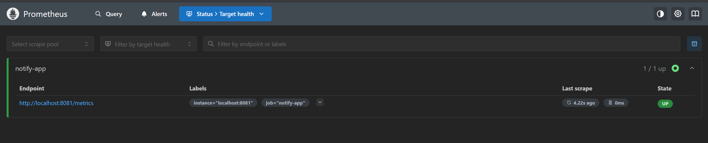

# 🚀 Notify - Distributed Notification Delivery Service (Go + gRPC + GraphQL + Prometheus)

This project simulates a **miniature version of how social media platforms (like Instagram or Twitter)** notify users when someone they follow creates a new post.

It uses:

- ✅ **gRPC** to simulate users publishing posts.
- ✅ **Background worker queue** to dispatch notifications.
- ✅ **Retry logic** for failed deliveries.
- ✅ **GraphQL API** to fetch a user’s notifications.
- ✅ **Prometheus metrics** to monitor performance and failures.

## 📦 Project Features Overview

| Feature                        | Description |
|-------------------------------|-------------|
| gRPC API                      | Simulates publishing a post (`PublishPost`) |
| Notification Queue            | In-memory delivery queue for notifications |
| Worker Pool                   | Concurrent workers simulate delivery |
| Retry Logic                   | Retry 3 times for failed notifications (10% simulated failures) |
| GraphQL API                   | Fetch recent notifications for a user |
| Prometheus Metrics            | Monitor sent, failed notifications, and delivery times |
| In-Memory Store               | All data (posts, followers, notifications) is stored temporarily in Go maps |

---

## ⚙️ How to Run

### ✅ Step 1: Start the System

```bash
make run
```

- gRPC Server → `localhost:5050`
- GraphQL Server → `localhost:8081`
- Prometheus Metrics → `localhost:8081/metrics`

---

### ✅ Step 2: Publish a Post (via gRPC)

Simulate post creation by a user:

```bash
grpcurl -plaintext -d '{"postId":"p1","authorId":"user1","content":"Hello world!"}' localhost:5050 post.PostService/PublishPost
```

🔄 What happens behind the scenes:

- Finds all followers of `user1` (from mock data).
- Creates a notification for each follower.
- Queues those notifications.
- Background workers pick from the queue and deliver them.
- Logs are printed to the terminal:

  ```
  ✅ Notification sent to user2 for post p1
  ```

---

### ✅ Step 3: Query Notifications (via GraphQL)

Use **Postman**, **Altair**, or a GraphQL client.

URL:  
```
http://localhost:8081/query
```

GraphQL query:
```graphql
{
  notifications(userId: "user2")
}
```

✅ Output:
```json
{
  "data": {
    "notifications": ["New post from user1: Hello world!"]
  }
}
```

---

### 📊 Step 4: Monitor with Prometheus

Visit:
```
http://localhost:8081/metrics
```

Key Metrics:

- `notifications_sent_total`: Total successful notifications
- `notifications_failed_total`: Failed notifications
- `notification_delivery_duration_seconds`: Delivery time (histogram)

Sample:
```
# HELP notifications_sent_total Total number of notifications successfully sent
notifications_sent_total 2

# HELP notifications_failed_total Total number of notifications that failed to send
notifications_failed_total 0

# HELP notification_delivery_duration_seconds Duration of notification deliveries
notification_delivery_duration_seconds_bucket{le="0.1"} 2
notification_delivery_duration_seconds_sum 0.01
notification_delivery_duration_seconds_count 2
```

Your README is already super clean and beginner-friendly! Here's a small addition you can place right under the **Prometheus Metrics** section to include the **Prometheus UI (manually)** setup instructions (since Docker is for later):

---

### 🖥️ Step 5: Add Prometheus UI (Manual Setup)

Want to visualize metrics in a dashboard instead of raw `/metrics` text? Here's how:

#### 📥 1. Download Prometheus 

Go to [https://prometheus.io/download/](https://prometheus.io/download/) and download the latest version for your OS.

#### 📁 2. Create a Config File (`prometheus.yml`)

In the same directory as `prometheus`, add a file named `prometheus.yml`:

```yaml
global:
  scrape_interval: 5s

scrape_configs:
  - job_name: 'notify_service'
    static_configs:
      - targets: ['localhost:8081']
```

#### ▶️ 3. Start Prometheus

In your terminal, run:

```bash
./prometheus --config.file=prometheus.yml
```

> 💡 Make sure you're inside the Prometheus directory when running this command.

#### 🌐 4. Open Prometheus UI

Visit:  
```
http://localhost:9090
```

- Search for metrics like `notifications_sent_total`
- Use the **Graph** tab to visualize delivery duration over time

---

Would you like me to commit this section directly into your README content above so it's fully integrated?

---

## 🧰 Under the Hood – Explained Simply

### 🟣 gRPC (PublishPost)

This simulates a user posting content:

```protobuf
rpc PublishPost(Post) returns (NotificationResponse);
```

It returns the number of notifications queued for delivery.

---

### 🔁 Queue + Dispatcher (Notification Engine)

- New notifications are added to a **Go channel (queue)**.
- A pool of **goroutines (workers)** process the queue.
- Each worker "sends" the notification (just logs it).
- If it fails (simulated 10% failure rate), it:
  - Retries up to 3 times
  - Waits longer each time (exponential backoff)

---

### 🧠 In-Memory Store

We simulate databases using maps in Go:

```go
// Map: user → their followers
map[string][]string

// Map: user → their notifications
map[string][]Notification
```

---

### 📈 Metrics via Prometheus

Track important health signals:

| Metric                        | Description |
|------------------------------|-------------|
| `notifications_sent_total`   | # sent |
| `notifications_failed_total` | # failed |
| `notification_delivery_duration_seconds` | Delivery speed |


---

## 🔥 What You Can Try Next

| Idea | Description |
|------|-------------|
| 💾 Persistent DB | Use SQLite/PostgreSQL instead of in-memory maps |
| 📲 WebSocket Push | Push new notifications in real-time |
| 🧪 Unit Tests | Write tests for retry logic and queue |
| 🐳 Docker Support | Containerize your service with Docker |


